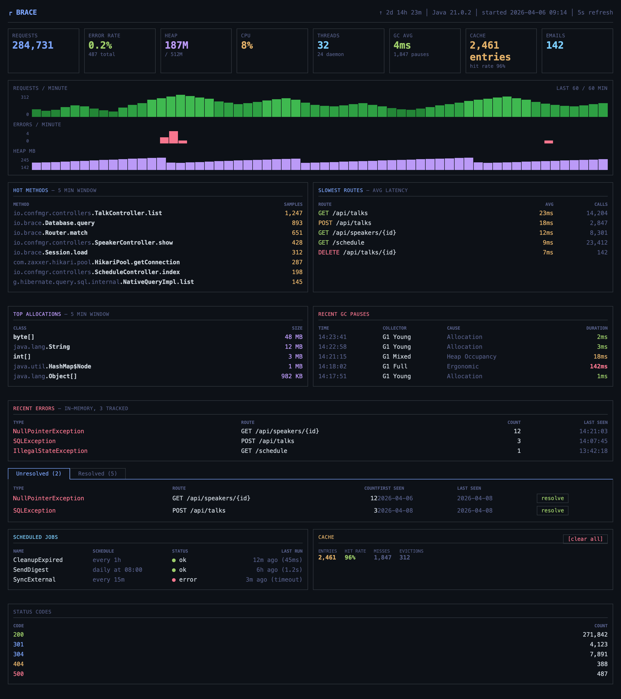

# Brace

A full-stack Java web framework optimized for AI token usage during development and runtime performance when deployed.

## Why Brace Exists

Current web frameworks were developed to be used by humans. They avoid boilerplate by introducing magical features like auto-configuration, bean scoping, proxy chains, and conditional loading. However, modern AI coding assistants write better code when frameworks are explicit and predictable and they are best when guided by strict compile time checking and unit tests.  

Brace is designed so that AI produces correct code on the first try:

- **Everything flows through parameters.** A controller method's signature tells you exactly what it has access to. No guessing about what's injected, what's ThreadLocal, what's magic.
- **Compile-time errors, not runtime surprises.** JTE templates fail the build if parameters are wrong. Method references fail to compile if signatures don't match. Wrong types are caught before anyone hits the page.
- **Small API surface.** ~15 core types. AI can hold the entire framework in context without running out of window.
- **One way to do each thing.** No choice between annotations vs XML vs programmatic config vs auto-detection. Just Java.

In benchmarks measuring AI token cost to build and extend a Conference Manager API (10 entities, 117 tests), Brace costs 33% less than Spring Boot on feature additions ($5.43 vs $8.16) — and the gap widens as the codebase grows:

| Phase | Brace | Spring | Saving |
|---|---|---|---|
| Greenfield build (6 entities, 35 tests) | $2.24 | $2.38 | 6% |
| + Speaker Availability | $1.01 | $1.59 | 36% |
| + Waitlist with Auto-Promotion | $1.02 | $1.14 | 11% |
| + Ratings & Speaker Stats | $0.75 | $1.18 | 36% |
| + Multi-Day Events & Tracks | $1.29 | $1.96 | 34% |
| + Notifications & Activity Feed | $1.36 | $2.29 | 41% |

The greenfield build is roughly tied — both frameworks are cheap when the codebase is empty. The advantage emerges as features accumulate and the AI has to read and modify existing code. Brace's context scales linearly (read the controller and its dependencies) while Spring's scales super-linearly (trace the DI graph, understand conditional beans, check profiles). Hono (TypeScript) performed comparably to Brace on token cost ($5.79 for feature additions) but trades runtime performance for simplicity. Full benchmark data and methodology: [ai-benchmark](https://github.com/mattonfoot/ai-benchmark).

### The Performance Story

Brace is also fast. No DI container overhead, no proxy indirection, no annotation processing at runtime. Hibernate's StatelessSession skips dirty checking and persistence context management. JTE templates compile to Java classes. Jetty 12 runs on virtual threads.

For a full-stack page render (5 DB queries + template), Brace with PostgreSQL is roughly 2x faster than the equivalent Spring Boot stack. Not because of any single optimization, but because every layer has less overhead: framework dispatch (~33us vs ~125us), no ORM lifecycle tax, compiled templates (~180us vs ~480us for Thymeleaf).

### AI Observability

No existing framework exposes a structured diagnostics API designed for AI agents. Brace does. The `/ops/status` endpoint returns everything an AI agent needs to diagnose any problem: request stats, slow routes, recent errors with full context (stack trace, request details, queries that ran before the error), job statuses, memory usage, per-minute timeseries. The built-in dashboard shows the same data visually. An AI agent can deploy via Dokploy, monitor via `/ops/status`, detect problems, fix code, and redeploy — autonomously.

## Quick Start

```java
public class App {
    public static void main(String[] args) throws Exception {
        var config = Config.load(Path.of("application.conf"), System.getProperty("brace.mode"));
        var db = new DatabaseFactory(config.get("db.url"), config.get("db.user"), config.get("db.pass"),
            List.of(Post.class, User.class));
        var mail = new Mailer(config.get("smtp.url")).from("noreply@myapp.com");

        var cache = Brace.cache();

        var app = Brace.app()
            .port(config.getInt("port", 8080))
            .database(db)
            .templates("views")
            .sessions(config.get("session.secret"))
            .mailer(mail)
            .ops(config.get("ops.secret"))
            .staticFiles("/assets", "public");

        var posts = new PostController();
        var auth = new AuthController(mail);

        app.before(Auth::requireLogin);
        app.get("/", cache.wrap("5m", posts::index));
        app.get("/posts/{id}", (DbHandler) posts::show);
        app.post("/posts", (FullHandler) posts::create);
        app.group("/auth", g -> {
            g.get("/login", auth::loginForm);
            g.post("/login", (SessionHandler) auth::login);
        });

        app.every("5m", "cleanup", new CleanupJob());
        app.daily("02:00", "digest", new DigestJob(mail));

        app.start();
    }
}
```

## What's Included

- **HTTP** -- Jetty 12 with virtual threads, programmatic routing, middleware, route grouping, static file serving
- **Database** -- Hibernate 7 StatelessSession, per-request transactions, Flyway migrations, `queryIn()` for batch lookups, `withSession()` for scoped access
- **Templates** -- JTE compiled templates with layout support, hot-reload in dev
- **Sessions** -- HMAC-SHA256 signed cookies, no server-side storage
- **Forms** -- Record-based form binding with validation annotations
- **CSRF** -- Automatic protection on POST/PUT/DELETE, skip for JSON APIs
- **Cache** -- In-memory with TTL, tag-based invalidation, route-level page caching via `cache.wrap()`
- **Jobs** -- In-memory recurring scheduler + durable database-backed queue with retry
- **Mailer** -- SMTP sending with dev-mode email capture
- **Ops** -- `/ops/status` diagnostics, `/ops/errors` exception tracking, `/ops/dashboard` built-in HTML dashboard, structured JSON logging
- **Testing** -- `Brace.test()` harness for fast in-process integration tests with H2
- **CLI** -- `brace new myapp` project scaffolding

## Philosophy

Brace is designed for AI-assisted development:

- **Explicit over implicit.** Every dependency is visible in `main()`. No classpath scanning, no auto-configuration, no proxy generation.
- **Compile-time over runtime.** Typed templates, typed parameters. Errors caught at build time, not when a user hits the page.
- **Small API surface.** ~15 core types. AI can hold the entire framework in context.
- **One way to do things.** No choice between annotations vs XML vs programmatic config. Just plain Java.

## Controllers

Plain classes. Dependencies via constructor. Request-scoped data via method parameters.

```java
public class PostController {
    public Result index(Request req, Database db) {
        var posts = db.findAll(Post.class);
        return View.of("posts/index", "posts", posts);
    }

    public Result show(Request req, Database db) {
        var post = db.find(Post.class, req.intParam("id"));
        if (post == null) return Result.notFound();
        return View.of("posts/show", "post", post);
    }

    public Result create(Request req, Database db, Session session) {
        var form = req.form(PostForm.class);
        if (!form.valid()) return View.of("posts/new", "form", form);
        var post = new Post();
        post.apply(form.value());
        post.authorId = session.getInt("userId");
        db.insert(post);
        return Redirect.to("/posts/" + post.id);
    }
}
```

## Handler Types

```java
app.get("/hello", req -> Result.text("Hello!"));                          // Handler: Request only
app.get("/posts", (DbHandler) (req, db) -> Json.of(db.findAll(Post.class))); // DbHandler: Request + Database
app.get("/profile", (SessionHandler) (req, session) -> ...);              // SessionHandler: Request + Session
app.post("/posts", (FullHandler) (req, db, session) -> ...);              // FullHandler: Request + Database + Session
```

## Database

```java
db.find(Post.class, id)                          // find by ID
db.insert(post)                                   // insert
db.update(post)                                   // update
db.delete(post)                                   // delete
db.findAll(Post.class)                            // all rows
db.query(Post.class, "author.id = ?", userId)     // HQL where clause
db.queryOne(Post.class, "slug = ?", slug)         // single result or null
db.queryIn(Post.class, "id", List.of(1, 2, 3))   // batch lookup with IN clause
db.count(Post.class, "published = ?", true)       // count with condition
db.sql("UPDATE posts SET views = views + 1 WHERE id = ?", id) // native SQL
```

For scoped DB access outside the request lifecycle (background tasks, WebSocket handlers):

```java
dbFactory.withSession(db -> {
    db.insert(new AuditLog("user signed up"));
});

var count = dbFactory.withSession(db -> db.count(User.class));
```

## Forms & Validation

```java
public record PostForm(
    @Required String title,
    @Required @MinLength(10) String body,
    @Email String contactEmail
) {
    public void validate(Errors errors) {
        if (title.contains("<script>")) errors.add("title", "no scripts allowed");
    }
}

var form = req.form(PostForm.class);
if (!form.valid()) return View.of("posts/new", "form", form);
```

## Sessions

```java
session.set("userId", user.id);
session.getInt("userId");
session.has("userId");
session.clear();
```

## Jobs

```java
// Recurring (in-memory)
app.every("5m", "cleanup", db -> db.sql("DELETE FROM sessions WHERE expired < NOW()"));
app.daily("02:00", "digest", db -> sendDigestEmails(db));

// Durable (database-backed, survives restarts)
Jobs.schedule(db, new SendReceipt(orderId), Duration.ofMinutes(5));
Jobs.schedule(db, new SendSurvey(orderId), Duration.ofDays(7),
    JobOptions.maxAttempts(5).backoff(Duration.ofMinutes(10)));
```

## Mailer

```java
mail.to("user@example.com")
    .subject("Welcome!")
    .html(View.render("emails/welcome", "user", user))
    .send();
```

Dev mode captures emails without sending. Access via `mailer.sent()` in tests.

## Cache

```java
var cache = Brace.cache();

cache.set("user:42", user, "30m");                 // set with TTL
cache.get("user:42", User.class);                  // get or null
cache.getOrSet("stats", "5m", () -> computeStats()); // compute on miss
cache.delete("user:42");                           // remove one
cache.deletePrefix("user:");                       // remove by prefix
cache.clearTag("simulation");                      // remove by tag

// Route-level page caching
app.get("/", cache.wrap("30m", ctrl::index).tags("simulation"));
app.get("/team/{id}", cache.wrap("30m", ctrl::team).tags("simulation"));
cache.clearTag("simulation");  // invalidate all cached pages at once
```

## Static Files

```java
app.staticFiles("/assets", "public");   // serve public/ directory at /assets/*
```

## Route Grouping

```java
app.group("/admin", admin -> {
    admin.get("/users", ctrl::list);
    admin.post("/users", ctrl::create);
    admin.group("/api", api -> {        // nesting supported
        api.get("/stats", ctrl::stats); // registers /admin/api/stats
    });
});
```

## AI Ops

Ops endpoints authenticate via `X-Ops-Key` header (query param fallback for dashboard browser access).

`GET /ops/status` — full diagnostics: uptime, request stats, status codes, slowest routes, memory, recent errors with stack traces, job statuses, mailer stats, per-minute timeseries.

`GET /ops/errors` — persistent exception tracking. Returns unresolved errors by default, `?status=resolved` for resolved. Errors are deduplicated by type + route, with occurrence counts. Designed for coding agents to pull production errors and work on fixes.

`POST /ops/errors/{id}/resolve` — marks an error as resolved. New occurrences after resolution create a new incident.

`GET /ops/dashboard` — built-in HTML dashboard with sparkline charts, JFR profiling, and color-coded metrics.

<details>
<summary>Dashboard screenshot</summary>



</details>

## Testing

```java
static TestApp app = Brace.test()
    .entities(Post.class, User.class)
    .templates("views")
    .start(app -> {
        app.get("/posts", (DbHandler) (req, db) -> Json.of(db.findAll(Post.class)));
    });

@Test void listPosts() {
    app.withDb(db -> { db.insert(newPost("Hello")); });
    var response = app.get("/posts");
    assertEquals(200, response.status());
    assertTrue(response.body().contains("Hello"));
}
```

## Configuration

```properties
port=8080
db.url=jdbc:postgresql://localhost:5432/myapp
db.user=myapp
db.pass=${DB_PASS}
session.secret=change-me
ops.secret=change-me

%dev.port=9000
%dev.db.url=jdbc:h2:mem:dev
%dev.db.user=
%dev.db.pass=
```

## Tech Stack

| Component | Technology |
|---|---|
| HTTP | Jetty 12 (virtual threads) |
| ORM | Hibernate 7 (StatelessSession) |
| Templates | JTE |
| Migrations | Flyway |
| JSON | Jackson |
| Passwords | jBCrypt |
| Email | Jakarta Mail |

**~4,500 lines of framework code. 202 tests.**
